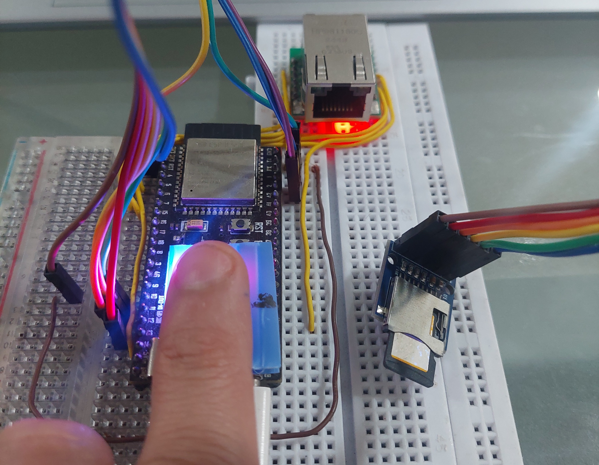
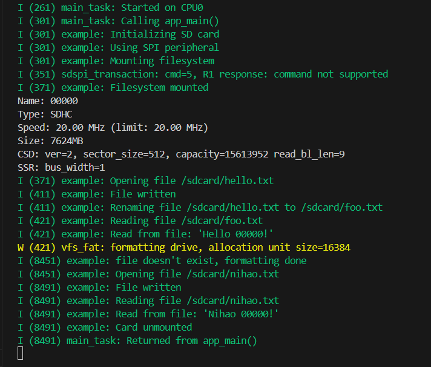

# ESP32-S3 and MicroSD Module with ESP-IDF

## Hardware  
Microcontroller: ESP32-S3-N16R8  
Ethernet Module: MicroSD Card Module (3.3V Version)  

## Pin Configuration  
| SD Module | ESP32-S3 |
|-----------|----------|
| PIN_CS    | 10       |
| PIN_MOSI  | 11       |
| PIN_SCLK  | 12       |
| PIN_MISO  | 13       |
| VCC       | 3V3      |
| GND       | GND      |

## Circuit
<figure>  
    
  <figcaption>  
    Figure 1. Circuit Diagram of the ESP32-S3 and Micro SD Module  
  </figcaption>  
</figure>  

## Output Example  
<figure>  
    
  <figcaption>  
    Figure 2. Output of the Program  
  </figcaption>  
</figure>  

## Troubleshooting

### Failure to mount filesystem

> The following error message is printed: `example: Failed to mount filesystem. If you want the card to be formatted, set the CONFIG_EXAMPLE_FORMAT_IF_MOUNT_FAILED menuconfig option.`

The example will be able to mount only cards formatted using FAT32 filesystem. If the card is formatted as exFAT or some other filesystem, you have an option to format it in the example code. Enable the `CONFIG_EXAMPLE_FORMAT_IF_MOUNT_FAILED` menuconfig option, then build and flash the example.

> Once you've enabled the `CONFIG_EXAMPLE_FORMAT_IF_MOUNT_FAILED` option, if you continue to encounter the following error:

```
E (600) sdmmc_cmd: sdmmc_read_sectors_dma: sdmmc_send_cmd returned 0x108
E (600) diskio_sdmmc: sdmmc_read_blocks failed (264)
W (610) vfs_fat_sdmmc: failed to mount card (1)
E (610) vfs_fat_sdmmc: mount_to_vfs failed (0xffffffff).
I (620) gpio: GPIO[13]| InputEn: 1| OutputEn: 0| OpenDrain: 0| Pullup: 0| Pulldown: 0| Intr:0
E (630) example: Failed to mount filesystem. If you want the card to be formatted, set the CONFIG_EXAMPLE_FORMAT_IF_MOUNT_FAILED menuconfig option.
```

Please ensure that your SD card is operational and not experiencing any malfunctions.


